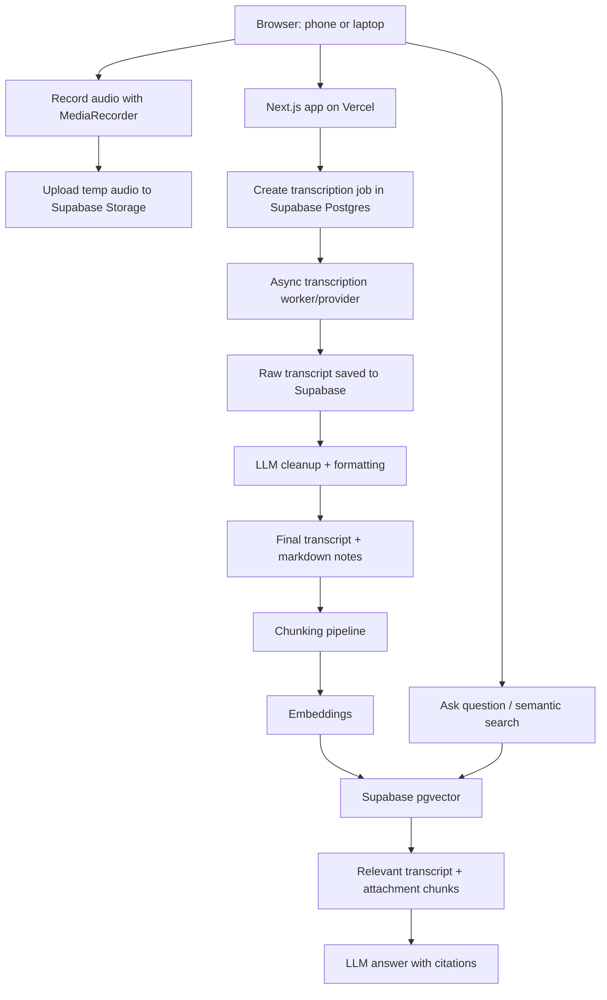

## Executive recommendation

Use **Next.js + Supabase + Vercel**, but do **not** run transcription or long AI processing directly inside Vercel serverless functions. Vercel Hobby functions are capped at **60 seconds when configured**, so long audio jobs should be async/background jobs instead. ([Vercel][1])

Recommended MVP stack:

| Layer           |                                        Recommended choice | Reason                                                                                                                |
| --------------- | --------------------------------------------------------: | --------------------------------------------------------------------------------------------------------------------- |
| Web app         |                       **Next.js App Router + TypeScript** | Easy Vercel deploy, clean full-stack structure, good PWA support                                                      |
| UI              |                                  **Tailwind + shadcn/ui** | Fast, minimal, mobile-friendly                                                                                        |
| Auth            |                        **Single password gate** initially | Matches your single-user need                                                                                         |
| Database        |                                     **Supabase Postgres** | You already know it; relational metadata + vector search in one DB                                                    |
| Vector DB       |                                     **Supabase pgvector** | Supabase supports `pgvector` for embeddings and vector similarity search. ([Supabase][2])                             |
| File storage    |                                      **Supabase Storage** | Temporary audio files + permanent supporting documents                                                                |
| Audio recording |                             **Browser MediaRecorder API** | Native browser recording; widely available since April 2021. ([MDN Web Docs][3])                                      |
| Transcription   | **AssemblyAI or Gladia for MVP; OpenAI as paid fallback** | Better async fit than forcing long audio through Vercel                                                               |
| Summaries / Q&A |                                      **Gemini API first** | Strong free tier for a personal app; can switch later                                                                 |
| Embeddings      |                 **Gemini Embedding or OpenAI embeddings** | Gemini Embedding can be tested free and is priced at $0.15 / 1M input tokens when paid. ([Google Developers Blog][4]) |

---

# 1. Product definition

## Core object model

The main object should be a **Note**.

A note can contain:

- One or more **recording segments**
- One or more **transcripts**
- One cleaned final transcript
- One or more generated outputs:

  - summary
  - markdown notes
  - action items
  - mind map
  - flashcards, optional

- One or more attached files:

  - SQL files
  - PDFs
  - slides
  - images
  - code files
  - documents

- Vector-indexed chunks for semantic search
- Chat/Q&A history against that note

This lets you handle your use case where one class, meeting, or professor conversation is recorded in several separate segments but still belongs to the same final note.

---

# 2. Recommended architecture



## Important design principle

Keep the app split into **interactive operations** and **long-running operations**.

Interactive operations:

- Login
- Create note
- Start/stop recording
- Upload files
- Search notes
- Ask short questions
- Display transcript

Long-running operations:

- Transcription
- Transcript cleanup
- Summary generation
- Mind map generation
- Attachment parsing
- Embedding generation
- Web-search expansion

Long-running operations should be handled as **jobs** with statuses like `queued`, `processing`, `completed`, `failed`.

---

# 3. Service choice

## Keep Supabase

Supabase is a good fit because it gives you:

- Postgres
- Storage
- Edge Functions
- Auth if you later want real auth
- `pgvector`
- Realtime updates if you want job progress
- Free tier that is sufficient for a personal MVP

Supabase’s free plan currently includes **50,000 monthly active users, 500 MB database size, 5 GB egress, 5 GB cached egress, and 1 GB file storage** according to the current official pricing result. ([Supabase][5])

The main constraint is database size. Transcripts are text, so they are small. Embeddings are the bigger issue. Use compact embedding dimensions when possible.

## Keep Vercel

Vercel is still the right hosting choice for the web app.

Use Vercel for:

- Next.js frontend
- UI rendering
- Small API endpoints
- Creating jobs
- Polling job status
- Generating signed upload URLs
- Lightweight LLM calls

Do **not** use Vercel for:

- Processing long audio files
- Waiting for transcription to finish
- Parsing large PDFs
- Long batch embedding jobs

---

# 4. AI provider strategy

## Best MVP setup

Use this split:

| Task                           |         Recommended provider | Why                                                |
| ------------------------------ | ---------------------------: | -------------------------------------------------- |
| Transcription                  | **AssemblyAI** or **Gladia** | Async transcription and generous free usage        |
| Summaries / Q&A                |             **Gemini Flash** | Strong free tier for personal use                  |
| Embeddings                     |         **Gemini Embedding** | Free testing, strong multilingual/coding retrieval |
| Optional high-quality fallback |                   **OpenAI** | Better predictable quality, but paid               |

AssemblyAI’s official pricing page says its free tier includes up to **185 hours of pre-recorded transcription** and **333 hours of streaming transcription**. ([AssemblyAI][6]) Gladia says it offers **10 hours of transcription free each month**. ([Gladia][7]) OpenAI’s `gpt-4o-mini-transcribe` is priced at an estimated **$0.003/minute**, and `gpt-4o-transcribe` at **$0.006/minute**. ([OpenAI Developers][8])

## Recommended abstraction

Do not hard-code one AI provider throughout the app.

Create adapters:

```ts
interface TranscriptionProvider {
  createJob(input: TranscriptionInput): Promise<ExternalTranscriptionJob>;
  getJobStatus(jobId: string): Promise<TranscriptionStatus>;
  getTranscript(jobId: string): Promise<RawTranscript>;
}

interface LLMProvider {
  generateSummary(input: SummaryInput): Promise<SummaryOutput>;
  answerQuestion(input: QAInput): Promise<QAOutput>;
  cleanTranscript(
    input: TranscriptCleanupInput,
  ): Promise<CleanTranscriptOutput>;
}

interface EmbeddingProvider {
  embedTexts(texts: string[]): Promise<number[][]>;
}
```

This lets you start with AssemblyAI/Gladia/Gemini and later switch to OpenAI, Deepgram, local Whisper, or another provider.

---

# 5. MVP feature scope

## MVP 1: Core recording + transcription

Build these first:

1. Password-protected app
2. Dashboard with notes
3. Create note
4. Record audio in browser
5. Upload audio segment
6. Send audio to transcription provider
7. Save raw transcript
8. Delete audio file after successful transcription
9. View transcript
10. Manually edit transcript
11. Generate cleaned transcript
12. Generate summary
13. Generate markdown notes
14. Semantic search across all notes

This is enough to make the app useful.

## MVP 2: Note Q&A + attachments

Add:

1. Ask questions about a note
2. Ask questions across all notes
3. Upload supporting files
4. Parse text attachments
5. Embed attachment chunks
6. Include attachments in Q&A context
7. Show sources used in answers

## MVP 3: Mind maps and richer synthesis

Add:

1. Mind map JSON generation
2. Visual mind map renderer
3. Export to Markdown
4. Export to PDF
5. Combine multiple notes
6. Web-search expansion

---

# 6. Database schema

## `notes`

Represents a meeting, lecture, professor conversation, or project discussion.

```sql
create table notes (
  id uuid primary key default gen_random_uuid(),
  title text not null,
  description text,
  note_type text check (note_type in ('meeting', 'lecture', 'office_hours', 'project', 'personal', 'other')) default 'other',

  created_at timestamptz default now(),
  updated_at timestamptz default now(),

  date_recorded timestamptz,
  participants text[],
  course_or_context text,

  raw_combined_transcript text,
  cleaned_transcript text,
  markdown_notes text,
  summary_short text,
  summary_long text,
  mind_map_json jsonb,

  processing_status text default 'draft',
  tags text[] default '{}'
);
```

## `recording_segments`

Each note can have multiple recordings.

```sql
create table recording_segments (
  id uuid primary key default gen_random_uuid(),
  note_id uuid references notes(id) on delete cascade,

  segment_index int not null,
  original_filename text,
  storage_path text,
  mime_type text,
  duration_seconds int,

  uploaded_at timestamptz default now(),
  transcription_status text default 'queued',

  external_provider text,
  external_job_id text,

  raw_transcript text,
  transcript_json jsonb,
  speaker_labels jsonb,

  audio_deleted boolean default false,
  error_message text
);
```

## `attachments`

Supporting files attached to a note.

```sql
create table attachments (
  id uuid primary key default gen_random_uuid(),
  note_id uuid references notes(id) on delete cascade,

  filename text not null,
  storage_path text,
  mime_type text,
  file_type text,
  file_size_bytes bigint,

  extracted_text text,
  extraction_status text default 'queued',

  created_at timestamptz default now(),
  error_message text
);
```

## `chunks`

The core retrieval table.

```sql
create table chunks (
  id uuid primary key default gen_random_uuid(),

  note_id uuid references notes(id) on delete cascade,
  source_type text check (source_type in ('transcript', 'attachment', 'summary', 'manual_note')),
  source_id uuid,

  chunk_index int not null,
  content text not null,

  token_count int,
  metadata jsonb default '{}',

  created_at timestamptz default now()
);
```

## `embeddings`

Use `pgvector`.

For Gemini Embedding at 768 dimensions:

```sql
create extension if not exists vector;

create table embeddings (
  id uuid primary key default gen_random_uuid(),
  chunk_id uuid references chunks(id) on delete cascade,

  embedding vector(768),
  embedding_model text not null,

  created_at timestamptz default now()
);

create index embeddings_vector_idx
on embeddings
using ivfflat (embedding vector_cosine_ops)
with (lists = 100);
```

Gemini Embedding supports dimension reduction down from 3072, and Google specifically recommends common output dimensions like 3072, 1536, or 768. ([Google Developers Blog][4]) For a personal app, use **768 dimensions** unless quality is clearly insufficient.

## `jobs`

General-purpose async job table.

```sql
create table jobs (
  id uuid primary key default gen_random_uuid(),

  job_type text not null,
  note_id uuid references notes(id) on delete cascade,
  segment_id uuid references recording_segments(id) on delete cascade,
  attachment_id uuid references attachments(id) on delete cascade,

  status text default 'queued',
  priority int default 5,

  payload jsonb default '{}',
  result jsonb,
  error_message text,

  attempts int default 0,
  max_attempts int default 3,

  created_at timestamptz default now(),
  started_at timestamptz,
  completed_at timestamptz
);
```

## `chat_messages`

For note-level Q&A.

```sql
create table chat_messages (
  id uuid primary key default gen_random_uuid(),
  note_id uuid references notes(id) on delete cascade,

  role text check (role in ('user', 'assistant', 'system')) not null,
  content text not null,

  cited_chunk_ids uuid[] default '{}',

  created_at timestamptz default now()
);
```

---

# 7. Storage design

Use Supabase Storage buckets:

```text
audio-temp/
  notes/{noteId}/segments/{segmentId}.webm

attachments/
  notes/{noteId}/{attachmentId}/{filename}

exports/
  notes/{noteId}/summary.md
  notes/{noteId}/mindmap.json
  notes/{noteId}/transcript.md
```

## Audio retention policy

For privacy and storage limits:

1. Upload audio to `audio-temp`.
2. Transcribe.
3. Save transcript.
4. Verify transcript saved.
5. Delete audio.
6. Set `audio_deleted = true`.

Keep a setting:

```ts
AUDIO_RETENTION_MODE =
  "delete_after_transcription" | "keep_24h" | "keep_forever";
```

Default:

```ts
delete_after_transcription;
```

---

# 8. Recording flow

## Browser recording

Use:

- `navigator.mediaDevices.getUserMedia({ audio: true })`
- `MediaRecorder`
- `audio/webm` where supported
- Chunked recording every 30–60 seconds

MDN states `getUserMedia()` prompts the user for permission to use media input devices. ([MDN Web Docs][9]) The MediaStream Recording API is designed to record audio/video streams and works with `getUserMedia()` for browser-based recording. ([MDN Web Docs][10])

## Why chunk recordings

Do not record one huge blob.

Record in chunks because:

- Safer on mobile browsers
- Easier retry logic
- Smaller upload failures
- Natural support for segmented transcripts
- Easier partial transcription
- Easier deletion after success

Recommended chunk length:

```text
MVP: 5–10 minute chunks
Better: 60–120 second chunks
Live-ish future: 10–30 second chunks
```

For a first version, make it simple:

```text
Start recording → Stop recording → Upload one segment
```

Then add chunked recording later.

---

# 9. Transcription pipeline

## Status flow

```text
recording_uploaded
→ transcription_queued
→ transcription_processing
→ transcription_completed
→ transcript_cleanup_queued
→ transcript_cleanup_completed
→ embedding_queued
→ searchable
```

## Raw transcript format

Save both plain text and provider JSON.

Plain text is easy to display. Provider JSON preserves:

- timestamps
- confidence
- speaker labels
- word-level metadata
- paragraphs
- utterances

```ts
type RawTranscript = {
  text: string;
  language?: string;
  durationSeconds?: number;
  utterances?: {
    speaker?: string;
    startMs: number;
    endMs: number;
    text: string;
    confidence?: number;
  }[];
  words?: {
    text: string;
    startMs: number;
    endMs: number;
    confidence?: number;
  }[];
};
```

## Transcript cleanup prompt

The cleanup step should **not summarize**. It should only clean formatting.

System instruction:

```text
You are cleaning a meeting transcript. Preserve meaning. Do not remove technical details. Do not invent content. Fix punctuation, paragraph breaks, obvious speech disfluencies, and speaker formatting. Keep uncertain words marked as [unclear]. Preserve timestamps when provided.
```

Output:

```json
{
  "cleaned_transcript": "...",
  "detected_topics": ["..."],
  "possible_errors": ["..."],
  "technical_terms": ["..."]
}
```

---

# 10. Chunking and embeddings

## Chunking strategy

Use different chunkers by source type.

### Transcript chunks

Chunk by semantic boundaries:

- Speaker turns
- Paragraphs
- Topic shifts
- 500–900 tokens per chunk
- 100-token overlap

Metadata:

```json
{
  "source": "transcript",
  "speaker": "Professor",
  "start_ms": 123000,
  "end_ms": 185000,
  "segment_index": 2,
  "topic": "SQL schema migration"
}
```

### Attachment chunks

For SQL files:

- Chunk by statement or object:

  - table definition
  - function
  - migration block
  - view
  - trigger

For markdown:

- Chunk by heading

For PDFs:

- Chunk by page and section

For code:

- Chunk by function/class/module where possible

## Embedding trigger

Every time these fields change:

- cleaned transcript
- markdown notes
- attachment extracted text

Run:

```text
delete old chunks for source
create new chunks
generate embeddings
insert embeddings
```

Supabase’s own automatic embeddings guide uses asynchronous calls, queues, Edge Functions, `pgmq`, `pg_net`, and `pg_cron` for semantic search pipelines, which matches this architecture. ([Supabase][11])

---

# 11. Semantic search

## Search flow

User query:

```text
“What did Professor X say about indexing the SQL table?”
```

Backend:

1. Generate embedding for the query.
2. Search `embeddings` with cosine similarity.
3. Filter by note, tag, date, or source type if needed.
4. Retrieve top chunks.
5. Rerank optionally.
6. Send chunks to LLM.
7. Generate answer with citations.

## SQL function

```sql
create or replace function match_chunks(
  query_embedding vector(768),
  match_count int default 8,
  filter_note_id uuid default null
)
returns table (
  chunk_id uuid,
  note_id uuid,
  content text,
  metadata jsonb,
  similarity float
)
language sql stable
as $$
  select
    chunks.id as chunk_id,
    chunks.note_id,
    chunks.content,
    chunks.metadata,
    1 - (embeddings.embedding <=> query_embedding) as similarity
  from embeddings
  join chunks on chunks.id = embeddings.chunk_id
  where filter_note_id is null or chunks.note_id = filter_note_id
  order by embeddings.embedding <=> query_embedding
  limit match_count;
$$;
```

## Answer citation format

Return answers like:

```text
The SQL file issue was about adding an index to avoid full-table scans on the `customer_events` table. The meeting transcript suggests the priority was query latency, not storage size.

Sources:
- Transcript segment 2, 12:04–13:20
- attachment: migration.sql, section `create index`
```

---

# 12. Note Q&A design

## Three Q&A modes

### 1. Ask this note

Uses only:

- this note’s transcripts
- this note’s attachments
- this note’s summaries

### 2. Ask all notes

Uses global semantic search across every note.

### 3. Ask with selected context

User manually selects:

- transcript segments
- attachments
- generated summary
- web search results

This is useful when you want precise control.

## Q&A prompt structure

```text
You answer questions using only the provided context unless web_search_context is provided.

Rules:
- Cite the chunks used.
- If the context does not contain the answer, say so.
- Do not invent names, dates, numbers, or decisions.
- Separate confirmed facts from inferred conclusions.
- If attached files conflict with the transcript, mention the conflict.
```

---

# 13. Supporting file pipeline

## File upload flow

```text
Upload file
→ Save in Supabase Storage
→ Create attachment row
→ Extract text
→ Chunk
→ Embed
→ Mark searchable
```

## File parsers

Use:

| File type                                          | Parser                         |
| -------------------------------------------------- | ------------------------------ |
| `.txt`, `.md`, `.csv`, `.sql`, `.py`, `.ts`, `.js` | Direct text extraction         |
| `.pdf`                                             | `pdf-parse` or external parser |
| `.docx`                                            | `mammoth`                      |
| `.pptx`                                            | later; not MVP                 |
| images                                             | later OCR                      |

## SQL-specific feature

For SQL files, add a lightweight parser that extracts:

- table names
- column names
- indexes
- constraints
- views
- functions
- triggers

Store as attachment metadata:

```json
{
  "sql_objects": {
    "tables": ["customer_events", "users"],
    "indexes": ["idx_customer_events_user_id"],
    "views": [],
    "functions": []
  }
}
```

This gives better retrieval and better summaries.

---

# 14. Mind map generation

Do not make the mind map a static image in the database. Store it as structured JSON.

## Mind map JSON

```ts
type MindMapNode = {
  id: string;
  label: string;
  summary?: string;
  children?: MindMapNode[];
  source_chunk_ids?: string[];
};
```

Example:

```json
{
  "id": "root",
  "label": "SQL meeting",
  "children": [
    {
      "id": "schema",
      "label": "Schema changes",
      "children": [
        {
          "id": "customer_events",
          "label": "customer_events table",
          "summary": "Discussed adding an index for faster user-based lookups."
        }
      ]
    }
  ]
}
```

Render with:

- `reactflow`
- `markmap`
- `mermaid`
- or a simple nested tree for MVP

Recommended MVP:

```text
Generate Mermaid mind map syntax + JSON tree.
```

---

# 15. Web-search expansion

This should be optional and explicit.

Button:

```text
Expand with web search
```

Use cases:

- Professor mentions a paper
- Meeting references an unfamiliar library
- Transcript mentions a technical concept
- You want official docs added to the note

## Recommended behavior

1. User selects a phrase or asks for expansion.
2. App searches the web.
3. User reviews found sources.
4. User clicks “Attach to note.”
5. Extracted web snippets become attachment-like context.
6. Embed them separately with `source_type = web`.

Do not automatically pollute notes with web content. Keep transcript facts separate from external explanations.

## Provider option

Gemini pricing currently lists free-tier Google Search grounding for some Flash models up to **500 requests per day**, depending on model/tier. ([Google AI for Developers][12]) For MVP, this is probably the easiest route if you already use Gemini.

---

# 16. Authentication and security

You said you do not care much about security yet. Still, because these are private professor/meeting transcripts, use a minimal baseline.

## MVP password gate

Use a single password stored as a hashed value in environment variables.

Environment variables:

```env
APP_PASSWORD_HASH=...
SESSION_SECRET=...
```

Flow:

```text
/login
→ password submitted
→ compare hash server-side
→ set httpOnly session cookie
→ access app
```

Do **not** store the password in client-side code.

## Minimal protections

Add:

- HTTPS only
- `httpOnly` cookie
- `sameSite=lax`
- no API keys in browser
- private Supabase buckets
- signed upload URLs
- delete audio after transcription
- service role key only on server

Later, you can migrate to Supabase Auth.

---

# 17. API design

## Next.js routes

```text
POST /api/login
POST /api/logout

GET  /api/notes
POST /api/notes
GET  /api/notes/:id
PATCH /api/notes/:id
DELETE /api/notes/:id

POST /api/notes/:id/segments
POST /api/segments/:id/upload-url
POST /api/segments/:id/transcribe
GET  /api/segments/:id/status

POST /api/notes/:id/attachments
POST /api/attachments/:id/extract

POST /api/notes/:id/generate-summary
POST /api/notes/:id/generate-markdown
POST /api/notes/:id/generate-mindmap

POST /api/notes/:id/ask
POST /api/search

POST /api/jobs/:id/retry
GET  /api/jobs/:id
```

## Internal services

```text
/lib/auth
/lib/supabase
/lib/storage
/lib/transcription
/lib/llm
/lib/embeddings
/lib/chunking
/lib/parsers
/lib/jobs
/lib/search
/lib/prompts
```

---

# 18. Frontend structure

## Pages

```text
/app
  /login
  /dashboard
  /notes/new
  /notes/[id]
  /search
  /settings
```

## Note page layout

Desktop:

```text
Left column:
- Transcript segments
- Attachments
- Generated outputs

Main:
- Cleaned transcript / markdown editor

Right:
- Ask this note
- Summary
- Sources
```

Mobile:

```text
Tabs:
- Record
- Transcript
- Summary
- Ask
- Files
```

## Main UI components

```text
<RecordButton />
<RecordingTimer />
<SegmentList />
<TranscriptEditor />
<SummaryPanel />
<AttachmentUploader />
<AskNoteChat />
<SemanticSearchBox />
<MindMapViewer />
<JobStatusBadge />
```

## Recording UI

Keep it extremely simple:

```text
[ New Note ]

Title: __________________

[ Start Recording ]

00:12:44

[ Stop & Upload ]

Status:
Recording uploaded
Transcribing...
Transcript ready
```

---

# 19. Editing model

You need to distinguish between:

1. Raw transcript
2. Cleaned transcript
3. User-edited transcript
4. Generated summaries

Recommended fields:

```sql
raw_combined_transcript text
cleaned_transcript text
user_edited_transcript text
active_transcript_version text
```

Where:

```text
active_transcript_version = raw | cleaned | user_edited
```

Semantic search should use the active transcript version.

When the user edits the transcript:

```text
save edit
→ mark embeddings stale
→ regenerate chunks
→ regenerate embeddings
```

Add a small indicator:

```text
Search index: up to date / needs refresh / rebuilding
```

---

# 20. Combining transcripts

A note should have many `recording_segments`.

The combine operation should:

1. Sort segments by `segment_index` or timestamp.
2. Concatenate transcript text.
3. Preserve segment boundaries.
4. Optionally run cleanup on the full combined transcript.
5. Generate final note outputs.

Combined transcript format:

```md
# Segment 1

[00:00–08:31]

Transcript text...

# Segment 2

[08:31–17:02]

Transcript text...
```

This prevents confusion if recordings are split.

---

# 21. Suggested extra features

## High-value additions

### 1. “Important decisions” extraction

For meetings:

```json
{
  "decisions": [
    {
      "decision": "Use indexed lookup on customer_events.user_id",
      "confidence": "high",
      "source": "segment 2, 12:04"
    }
  ]
}
```

### 2. Action items

```json
{
  "action_items": [
    {
      "task": "Update SQL migration with index",
      "owner": "Giacomo",
      "deadline": null,
      "source": "segment 2"
    }
  ]
}
```

### 3. Technical term glossary

Very useful for lectures.

```json
{
  "term": "B-tree index",
  "definition_from_context": "...",
  "external_expansion": "optional"
}
```

### 4. “Unclear audio” review queue

Track low-confidence sections:

```text
Review needed:
- 14:22–14:41: unclear phrase about database migration
- 31:05–31:10: possible acronym
```

### 5. Automatic title generation

After transcription:

```text
“Office hours: SQL indexing and migration strategy”
```

### 6. Lecture mode

For professor recordings:

- definitions
- formulas
- examples
- likely exam topics
- questions to ask next time

### 7. Meeting mode

For meetings:

- decisions
- action items
- blockers
- timeline
- owners

### 8. Code/project mode

For project discussions:

- referenced files
- implementation decisions
- bugs
- TODOs
- architecture changes

---

# 22. Cost-control plan

## Free/cheap MVP

Use:

- Supabase free tier
- Vercel Hobby
- AssemblyAI free tier or Gladia free monthly transcription
- Gemini free tier for summaries and Q&A
- Gemini Embedding free testing

Gemini rate limits are project/model/tier-dependent and visible in AI Studio; Google says rate limits are applied per project, not per API key, and may vary by model/tier. ([Google AI for Developers][13])

## Practical single-user estimate

For a personal app:

```text
10 recordings/month × 30 min = 300 min/month
300 min = 5 hours/month
```

This should fit comfortably inside Gladia’s 10 free hours/month or AssemblyAI’s free usage, assuming their limits remain available.

Text generation and embeddings are also likely to stay low because transcripts are relatively small compared with high-volume production workloads.

---

# 23. Implementation phases

## Phase 1 — Foundation

Build:

- Next.js app
- Supabase project
- DB schema
- password login
- dashboard
- create/edit/delete notes

Deliverable:

```text
User can log in and create notes.
```

## Phase 2 — Recording and upload

Build:

- browser audio recording
- audio preview
- upload to Supabase Storage
- `recording_segments` table integration
- job creation

Deliverable:

```text
User can record and attach audio segments to a note.
```

## Phase 3 — Transcription

Build:

- transcription provider adapter
- async transcription job
- status polling
- raw transcript display
- delete audio after success

Deliverable:

```text
User can record audio and receive a transcript.
```

## Phase 4 — Cleanup and summaries

Build:

- transcript cleanup
- markdown note generation
- short summary
- long summary
- action items
- decisions

Deliverable:

```text
User can turn transcripts into readable notes.
```

## Phase 5 — Vector search

Build:

- chunking
- embedding generation
- `pgvector` search function
- global semantic search UI

Deliverable:

```text
User can search notes semantically.
```

## Phase 6 — Q&A

Build:

- note-level retrieval
- global retrieval
- answer generation
- source citations

Deliverable:

```text
User can ask questions about one note or all notes.
```

## Phase 7 — Attachments

Build:

- upload files
- text extraction
- chunk attachments
- embed attachments
- include attachments in Q&A

Deliverable:

```text
User can attach files like SQL files and ask questions using both transcript and file context.
```

## Phase 8 — Mind maps and export

Build:

- mind map JSON generation
- visual renderer
- markdown export
- optional PDF export

Deliverable:

```text
User can view structured maps and export notes.
```

---

# 24. Coding-agent handoff brief

Use this as the high-level implementation directive:

```text
Build a single-user Next.js + Supabase web app for recording, transcribing, summarizing, and semantically searching personal meeting/lecture notes.

Core stack:
- Next.js App Router
- TypeScript
- Tailwind CSS
- shadcn/ui
- Supabase Postgres
- Supabase Storage
- Supabase pgvector
- Vercel deployment

Core entities:
- notes
- recording_segments
- attachments
- chunks
- embeddings
- jobs
- chat_messages

Core flows:
1. User logs in with a single password.
2. User creates a note.
3. User records audio in browser using MediaRecorder.
4. Audio uploads temporarily to Supabase Storage.
5. App creates a transcription job.
6. Transcription provider processes audio asynchronously.
7. Raw transcript is saved.
8. Audio is deleted after successful transcription.
9. Transcript is cleaned and formatted by an LLM.
10. Clean transcript is chunked.
11. Chunks are embedded and inserted into Supabase pgvector.
12. User can search notes semantically.
13. User can ask questions against one note or all notes.
14. User can upload supporting files, extract text, embed them, and use them as context.
15. User can generate summaries, markdown notes, action items, decisions, and mind maps.

Important constraints:
- Do not run long transcription jobs inside Vercel request handlers.
- Use async job statuses.
- Keep AI providers behind adapter interfaces.
- Do not expose provider API keys to the browser.
- Delete audio files after transcription by default.
- Keep transcript facts separate from web-search expansions.
```

---

## Final recommendation

Your original idea is technically coherent. The best first implementation is:

```text
Next.js on Vercel
+ Supabase Postgres/Storage/pgvector
+ browser MediaRecorder
+ AssemblyAI or Gladia for transcription
+ Gemini for summaries/Q&A/embeddings
+ async job table for all long-running work
```

Do not overbuild live transcription for the MVP. Start with **record → upload → transcribe → clean → summarize → embed → search**. Live transcription, web expansion, mind maps, and advanced file parsing can be added cleanly after the base pipeline works.

[1]: https://vercel.com/docs/plans/hobby "Vercel Hobby Plan"
[2]: https://supabase.com/docs/guides/database/extensions/pgvector "pgvector: Embeddings and vector similarity | Supabase Docs"
[3]: https://developer.mozilla.org/en-US/docs/Web/API/MediaRecorder?utm_source=chatgpt.com "MediaRecorder - Web APIs | MDN"
[4]: https://developers.googleblog.com/gemini-embedding-available-gemini-api/ "
            
            Gemini Embedding now generally available in the Gemini API
            
            
            - Google Developers Blog
            
        "
[5]: https://supabase.com/pricing?utm_source=chatgpt.com "Pricing & Fees"
[6]: https://www.assemblyai.com/pricing "AssemblyAI | Pricing | Production-ready AI Models"
[7]: https://www.gladia.io/pricing "Gladia | Pricing"
[8]: https://developers.openai.com/api/docs/pricing "Pricing | OpenAI API"
[9]: https://developer.mozilla.org/en-US/docs/Web/API/MediaDevices/getUserMedia?utm_source=chatgpt.com "MediaDevices: getUserMedia() method - Web APIs | MDN"
[10]: https://developer.mozilla.org/en-US/docs/Web/API/MediaStream_Recording_API/Using_the_MediaStream_Recording_API?utm_source=chatgpt.com "Using the MediaStream Recording API - MDN Web Docs"
[11]: https://supabase.com/docs/guides/ai/automatic-embeddings "Automatic embeddings | Supabase Docs"
[12]: https://ai.google.dev/gemini-api/docs/pricing "Gemini Developer API pricing  |  Gemini API  |  Google AI for Developers"
[13]: https://ai.google.dev/gemini-api/docs/rate-limits "Rate limits  |  Gemini API  |  Google AI for Developers"
